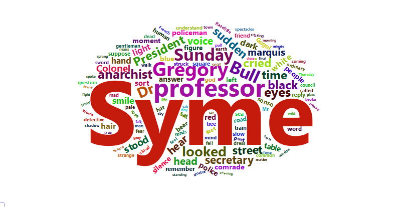

## Идея парсера    

Во всевозможных веб-инструментах, требующих генерации большого количества уникальных имён (например, Google API, имена пользователей на reddit, капча), используются сочетания из случайных слов. Код этого репозитория генерирует случайное словосочетание из двух слов, оперируя существительными и прилагательными английского языка, которые чаще всего встречаются в заданном тексте. На данный момент это один текст: "The Man Who Was Thursday" за авторством Г.К.Честертона из Библиотеки Гутенберга [^1].   

Решение имеет два ограничения:   

1. В любом тексте будут встречаться формы одного и того же слова, например, единственное и множественное число, настоящее и прошедшее время. Для учёта повторов мы используем ограниченное количество форм слов английского языка: основа и варианты окончаний: «d», «ed», «es», «ly», «ied»/«y», «r», «s». При этом основой слова мы далее будем называть всё кроме перечисленных окончаний.       

1. Закономерно, что имена главных персонажей в большинстве книг будут встречаться чаще имён нарицательных. Из соображений улучшения однородности данных, генерировать случайные словосочетания целесообразно из имён нарицательных. Для разделения слов на имена собственные и нарицательные мы просто проверяем, входит ли слово в текст с большой или с маленькой буквы, либо и то, и другое. Это подход имеет минусы, в частности, имя нарицательное, встретившееся один раз, будет считаться именем собственным. Мы обходим этот момент, выбирая для генерации только слова с частотой встречаемости выше некоторого порога $k > 1$.    

По сути, 99% кода решает задачи очистки текстовых данных. Существенная часть этого процесса -- подсчёт частот в соответствии с ограничением №1, описанным выше.   


## Зависимости   

Код требует загрузки следующих пакетов:   

* ```knitr``` [^3]
* ```readtext``` [^4]
* ```dplyr``` [^5]
* ```data.table``` [^6]
* ```wordcloud2``` [^7]
* ```RColorBrewer``` [^8]
* ```htmlwidgets``` [^9]
* ```webshot``` [^10]


## Результаты  


После предварительной очистки от стоп-слов в наборе данных осталось 5 095 слов. На рисунке ниже показано облако слов с частотой не менее 20 до соотнесения с частями речи. Чаще всего встречается "Syme" -- имя главного героя книги. "Bull", "Gregory", "Dr" также относятся к именам персонажей.   



Рисунок 1. Облако слов по книге "The Man Who Was Thursday" с частотой не менее 20.   

Чтобы поставить каждому слову в соответствие часть речи, мы использовали таблицу по Оксфордскому словарю [^2]. Словарная таблица содержит только имена нарицательные, поэтому имена персонажей отфильтровываются автоматически (кроме Sunday, которое мы оставим в итоговом наборе). Некоторым нарицательным существительным и прилагательным из книги также не нашлось соответствия в этом словаре (например, anarchist, feet), и части речи для них пришлось добавить вручную.   


После того как мы объединили словоформы, осталось 633 слов, из них 458 существительных (см. таблицу ниже).   

Таблица 1. -- Существительные и прилагательные в итоговом наборе слов ```words_to_shuffle```    


|Часть речи | Частота|
|:----------|-------:|
|adjective  |     175|
|noun       |     458|


Облако слов для итогового набора для создания случайных словосочетаний показано на втором рисунке. Градиент цвета пропорционален частоте встречаемости слова.   


Рисунок 2. Облако слов по книге для создания словосочетаний: красным цветом показаны существительные, синим - прилагательные.   

Функция ```uf_random_two_words_by_book()``` выбирает из итогового набора данных прилагательное и существительное случайным образом. Пример использования:    


``` r
# 4. Наконец составляем собственно случайное словосочетание ####################

uf_random_two_words_by_book(words_to_shuffle, my_seed)
```

```
## [1] "living-body"
```


В таблице показано ещё несколько примеров словосочетаний на базе книги.   


Таблица 2. -- Примеры словосочетаний и соответсвующие ядра для генератора случайных чисел    


| Ядро генератора случайных чисел|Словосочетание  |
|-------------------------------:|:---------------|
|                             455|calm-Tuesday    |
|                             433|central-pocket  |
|                            1259|drunk-blood     |
|                             142|evident-march   |
|                             294|evil-sir        |
|                             181|fat-character   |
|                            -337|loose-hair      |
|                             913|original-steel  |
|                             996|rude-bench      |
|                            1099|simple-universe |


## Планы   

🔸 📋 Найти более полный словарь для определения частей речи.    

🔸 📚 Добавить другие книги из Библиотеки Гуттенберга.   


[^1]: Project Gutenberg. URL: [https://www.gutenberg.org/](https://www.gutenberg.org/).   

[^2]: Репозиторий Stopwords ISO на github.com. URL: [https://github.com/stopwords-iso/stopwords-iso](https://github.com/stopwords-iso/stopwords-iso).  

[^3]: Xie Y (2025). _knitr: A General-Purpose Package for Dynamic Report
  Generation in R_. R package version 1.50, <https://yihui.org/knitr/>.    
  
[^4]: Benoit K, Obeng A (2025). _readtext: Import and Handling for Plain and
  Formatted Text Files_. doi:10.32614/CRAN.package.readtext
  <https://doi.org/10.32614/CRAN.package.readtext>, R package version 0.92.1,
  <https://CRAN.R-project.org/package=readtext>.    
  
[^5]: Wickham H, François R, Henry L, Müller K, Vaughan D (2023). _dplyr: A
  Grammar of Data Manipulation_. doi:10.32614/CRAN.package.dplyr
  <https://doi.org/10.32614/CRAN.package.dplyr>, R package version 1.1.4,
  <https://CRAN.R-project.org/package=dplyr>.    
  
[^6]: Barrett T, Dowle M, Srinivasan A, Gorecki J, Chirico M, Hocking T,
  Schwendinger B, Krylov I (2025). _data.table: Extension of `data.frame`_.
  doi:10.32614/CRAN.package.data.table
  <https://doi.org/10.32614/CRAN.package.data.table>, R package version
  1.17.8, <https://CRAN.R-project.org/package=data.table>.    
  
[^7]: Lang D, Chien G (2018). _wordcloud2: Create Word Cloud by 'htmlwidget'_.
  doi:10.32614/CRAN.package.wordcloud2
  <https://doi.org/10.32614/CRAN.package.wordcloud2>, R package version
  0.2.1, <https://CRAN.R-project.org/package=wordcloud2>.    
  
[^8]: Neuwirth E (2022). _RColorBrewer: ColorBrewer Palettes_.
  doi:10.32614/CRAN.package.RColorBrewer
  <https://doi.org/10.32614/CRAN.package.RColorBrewer>, R package version
  1.1-3, <https://CRAN.R-project.org/package=RColorBrewer>.    
  
[^9]: Vaidyanathan R, Xie Y, Allaire J, Cheng J, Sievert C, Russell K (2023).
  _htmlwidgets: HTML Widgets for R_. doi:10.32614/CRAN.package.htmlwidgets
  <https://doi.org/10.32614/CRAN.package.htmlwidgets>, R package version
  1.6.4, <https://CRAN.R-project.org/package=htmlwidgets>.    
  
[^10]: Chang W (2023). _webshot: Take Screenshots of Web Pages_.
  doi:10.32614/CRAN.package.webshot
  <https://doi.org/10.32614/CRAN.package.webshot>, R package version 0.5.5,
  <https://CRAN.R-project.org/package=webshot>.    

[^11]: Репозиторий Oxford Word Lists пользователя nalgeon на github.com. URL: [https://github.com/nalgeon/words](https://github.com/nalgeon/words).   
